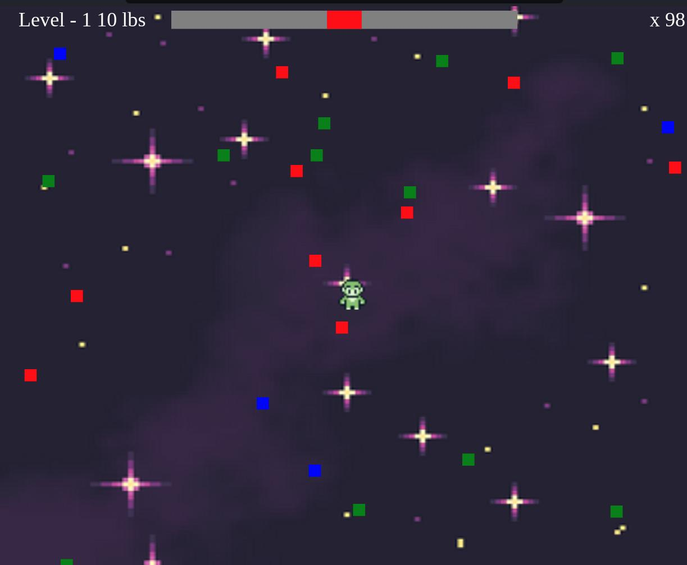

# game-consuma-ts
Do you remember the minigame consumo from Bully(PS2)? It's kinda the same.

## Install and run
To install is really simple

### install
```bash
npm install
```

### run
```bash
npm run serve
```

## Game
You need to get the red food and avoid the green food which is poisoned. While you avoid the blue ones.




## Credits

sprite: https://gibbongl.itch.io/8-directional-gameboy-character-template

background: https://evil49nd.itch.io/space-background

background2: https://deep-fold.itch.io/space-background-generator

musics: https://ansimuz.itch.io/adventure-music-collection-pack-1

musics: https://ryanavx.itch.io/breezys-mega-quest

sfx: https://jdwasabi.itch.io/8-bit-16-bit-sound-effects-pack